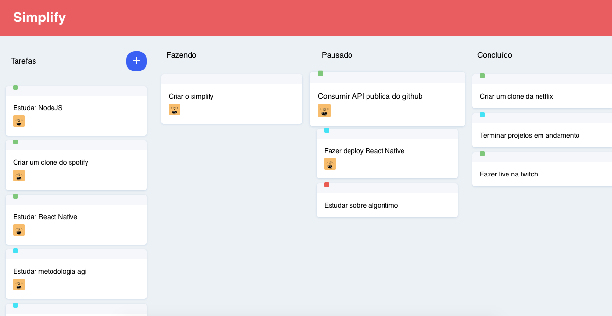

<h1 align="center">
  
</h1>

<h4 align="center">
  Simplify
</h4>

<p align="center">
  <a target="_blank" href="https://github.com/lineuxyz/simplify-kanban/stargazers"></a>
  
  
  
  
  <a target="_blank" href="https://www.linkedin.com/in/lineu-pastorelli-5165a7186"></a>
</p>

<p align="center">
  <a href="#-project">Project</a>&nbsp;&nbsp;&nbsp;|&nbsp;&nbsp;&nbsp;
  <a href="#-technologies">Technologies</a>&nbsp;&nbsp;&nbsp;|&nbsp;&nbsp;&nbsp;
  <a href="#-layout">Layout</a>&nbsp;&nbsp;&nbsp;|&nbsp;&nbsp;&nbsp;
  <a href="#-how-to-use">How to use</a>&nbsp;&nbsp;&nbsp;|&nbsp;&nbsp;&nbsp;
  <a href="#-how-to-contribute">How to contribute</a>&nbsp;&nbsp;&nbsp;|&nbsp;&nbsp;&nbsp;
  <a href="#-license">License</a>
</p>

<h1 align="center">
  
</h1>

## 📚 Project

Simplify is a project with the objective of creating a to-do list, organizing projects between teams so that everyone can see what each one is doing, thus making is easier to manage a project.

## 🖥 Technologies

  * [ReactJS](https://reactjs.org)
  * [Yarn](https://yarnpkg.com)
  * [React-icons](https://react-icons.github.io/react-icons/)
  * [Styled-components](https://styled-components.com/docs)
  * [Commitizen](https://github.com/commitizen/cz-cli)

## 🔖 Layout 

<p align="center">
  
    
</p>

## ❓ How to use

To clone an run this application, you'll need [Git](https://git-scm.com), [Yarn](https://yarnpkg.com) or [NPM](https://www.npmjs.com) installed on your computer.

Execute the command line:

### Clone the project
```bash
# Clone this reposity
$ git clone https://github.com/lineuxyz/simplify-kanban

# Go into the repository
$ cd simplify-kanban

# Install dependencies
$ yarn install or npm install 

# Run project
$ yarn start or npm start
```

## 🤔 How to contribute

* Make a fork;
* Create a branch com your feature: `git checkout -b my-feature`;
* Commit changes: `git commit -m "feat: my new feature`;
* Make a push to your branch: `git push origin my-feature`

After meging your receipt request to done, you can delete a branch from yours.

## 📜 License 

This project is under the MIT license. See the [LICENSE](LICENSE) for details.

Made ❤️ with by <a target="_blank" href="https://www.linkedin.com/in/lineu-pastorelli-5165a7186">Lineu Pastorelli</a>